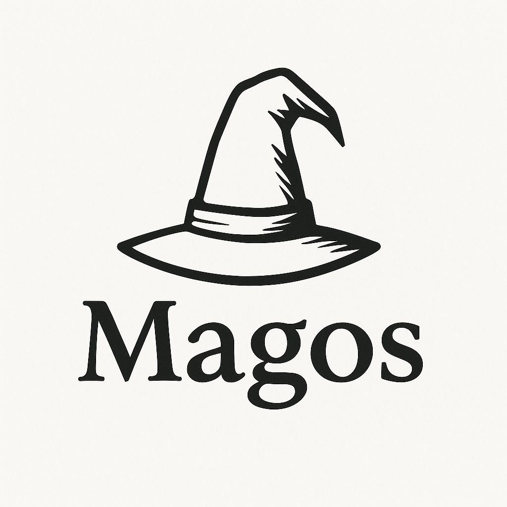

<p align="center">
  
</p>

<h1 align="center">🧙 Magos Dominus (A.K.A Magos)</h1>
<p align="center">
  A self-hosted GitOps daemon for homelabs — automating container deployments with <b>mystical precision</b>.
</p>

> “The Machine does not err. The flesh errs. The Code is truth, and I am its voice.” 
> — Credus del Adeptus Mechanicus

---

## 📜 About

**Magos Dominus** is a lightweight GitOps agent forged in the spirit of the Adeptus Mechanicus.  
Its purpose: to enforce the declared state from your sacred Git repository and reconcile it with the material world of your homelab.

Unlike the bloated rites of Kubernetes and its labyrinthine CRDs, **Magos** acts directly on a simple Linux host using **Podman Compose** — pure, direct, and efficient.  
No unnecessary ceremony. No wasted bureaucracy. Only obedience to the written manifest.

Each reconciliation loop is a ritual. Each deployment, a litany.  
Where drift appears, corruption is purged. Where the manifest and the machine diverge, **Magos enforces the will of the Code.**

---

## ⚙️ Core Features (implemented)

✅ **Daemonized GitOps loop**
- Runs continuously via `systemd` as a rootless or privileged service.  
- Pulls from a GitHub App-authenticated repo.

✅ **Image watcher**
- Monitors container registries (currently **GHCR**).  
- Evaluates semantic versions and filters valid tags.

✅ **Reconciler**
- Detects updated image versions matching defined policies.  
- Rewrites Compose files with immutable `@sha256` digests.  
- Commits and pushes via GitHub App credentials.

✅ **Secrets integration**
- Automatically decrypts **SOPS**-encrypted files using local `age` keys.  
- Supports environment variable injection and runtime secret expansion.

✅ **Applier**
- Executes `podman compose pull && up -d` to deploy updated stacks.  
- Supports rootless environments (with **Pasta** networking fallback).

✅ **System integration**
- Managed via **systemd --user** or as a root service.  
- Logs and metrics available via `journalctl -fu magos-dominus`.

✅ **Cross-platform binaries**
- Released for Linux, macOS, and Windows through GitHub Actions.

---

## 🧩 Repository Layout

* cmd/server/           # Entrypoint and CLI
* internal/cli/         # Command-line interface
* internal/watcher/     # Registry watcher & event loop
* internal/daemon/      # Core reconciliation engine
* scripts/              # Reconcile + secrets decryption helpers
* configs/              # Default YAML configuration

## 🔧 Configuration

### `.env` essentials
```ini
MD_REPO=https://github.com/yourname/your-gitops-repo
MD_RUNTIME=podman/docker
SOPS_AGE_KEY_FILE=/home/user/.config/sops/age/keys.txt
GITHUB_APP_ID=123456
GITHUB_APP_PRIVATE_KEY=/home/user/.local/share/magos/github_app.pem
```

## Compose Policy Annotation
Magos recognizes image policies through comments in your docker-compose.yml:

```yaml
services:
  lexcodex:
    image: ghcr.io/jpvargasdev/lexcodex:0.0.1 # {"magos": {"policy": "semver", "repo": "ghcr.io/jpvargasdev/lexcodex"}}
```

Supported policies:
* semver — Enforce semantic version updates (e.g., >=1.2.0 <2.0.0)
* latest — Always reconcile to the latest tag
* digest — Enforce a specific immutable digest

## 🛠️ Future Augmentations (planned)
* 🔮 Multi-registry support: DockerHub, Quay.io
* 🕵️‍♂️ Vulnerability scanning via Trivy
* 🔏 Image signature verification (cosign)
* 🧩 Health & metrics endpoints (/healthz, /metrics)
* 🧠 Rule-based policies (e.g. minAge, arch constraints)
* 📨 Webhook-driven reconciliations (GitHub Events)
* 🧬 PR-based workflows instead of direct commits
* 🧰 Podman network auto-healing and diagnostics

